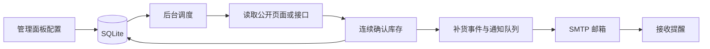

# VPS Radar · 补货雷达

[](https://github.com/Super-YYQ/vps-monitor/actions/workflows/ci.yml)
[](https://www.python.org/)
[](compose.yaml)
[](LICENSE)

**在自己的服务器上监控 VPS 补货，通过中文管理面板选择商家、配置规则，在确认补货时接收邮件提醒。**

后台独立运行，关闭浏览器不影响监控。使用 Python、FastAPI、SQLite 和原生 HTML/CSS/JavaScript，无需 Redis、独立数据库或前端构建服务。

[快速开始](#快速开始) · [设置说明](docs/configuration.md) · [邮件通知](docs/email/README.md) · [部署运维](docs/deployment.md) · [问题反馈](https://github.com/Super-YYQ/vps-monitor/issues)

## 目录

- [功能特性](#功能特性)
- [快速开始](#快速开始)
- [首次使用](#首次使用)
- [邮件通知配置](#邮件通知配置)
- [商家与机型](#商家与机型)
- [工作方式](#工作方式)
- [文档导航](#文档导航)
- [本地开发](#本地开发)
- [项目结构](#项目结构)
- [已知限制](#已知限制)
- [参与贡献](#参与贡献)
- [参考项目与资料](#参考项目与资料)
- [许可证](#许可证)

## 功能特性

| 功能         | 说明                                                         |
| ------------ | ------------------------------------------------------------ |
| 自定义监控   | 自由填写商家、型号、地区、检测地址、购买地址、价格与配置备注 |
| 商家机型库   | 7 家商家、13 个候选预设；可编辑或自行添加任意公开产品页      |
| 多种检测方式 | WHMCS 商品配置页 / 目录、HTML 单产品区域、JSON 库存字段      |
| 镜像源兜底   | 官网被 Cloudflare 拦截时，自动改用聚合站（限频 + 轮换 + 缓存） |
| 中文管理面板 | 库存总览、搜索筛选、检查历史、库存变化、24 小时检测健康度    |
| 邮件通知     | 多组 SMTP 配置切换、SSL / STARTTLS、多收件人、测试及重试      |
| 稳定调度     | 连续确认、补货去重、异常退避、同站点串行和并发上限           |
| 数据管理     | SQLite 持久化、JSON 配置导入导出、一致性备份脚本             |
| 登录保护     | 管理员密码、会话与 CSRF 校验、SMTP 授权码加密存储            |
| 自部署       | Docker Compose、一键安装脚本、可选 Caddy 自动 HTTPS          |

## 快速开始

### 方式一：Linux 服务器一键部署

准备一个指向服务器的域名，并开放 TCP 80、443 端口。在服务器执行：

```bash
git clone https://github.com/Super-YYQ/vps-monitor.git
cd vps-monitor
bash deploy.sh --domain radar.example.com
```

将 `radar.example.com` 替换为自己的域名。脚本会生成随机管理员密码，构建镜像并启动服务；没有 Docker 时会调用官方安装程序，需要 root 或 sudo 权限。

打开 `https://你的域名`，首次密码查看服务器仓库 `.env` 中的 `ADMIN_PASSWORD`。`.env` 只用于第一次初始化密码；在面板修改密码后，以新密码为准。

### 方式二：先通过 SSH 隧道体验

没有域名时，在服务器项目根目录执行：

```bash
bash deploy.sh
```

在自己的电脑执行：

```bash
ssh -L 8080:127.0.0.1:8080 user@server
```

访问 [本地控制台](http://127.0.0.1:8080/)。将 `user@server` 替换为自己的 SSH 登录信息；如果本机 8080 已被占用，可以使用 `-L 18080:127.0.0.1:8080` 并访问本机 18080。

### 方式三：已有 Docker，手动启动

```bash
cp .env.example .env
# 编辑 .env，替换 ADMIN_PASSWORD，占位密码不能用于启动

docker compose up -d --build --wait
```

默认只将服务映射到服务器 `127.0.0.1:8080`。反向代理、HTTPS、端口修改和备份方法见 [部署运维](docs/deployment.md)。

## 首次使用

1. **登录控制台**，在“商家与机型”挑选候选，或点击“自定义监控”。
2. **核对检测规则**：填写当前产品地址及产品名，点击“试运行规则”。试运行不会发信或修改监控状态。
3. **开启监控**：保存前勾选“启用监控”。预设与导入配置默认暂停。
4. **配置邮件**：在“邮件通知”新增 SMTP 配置，选为当前配置后发送测试邮件，在“通知记录”查看投递结果。
5. **选择通知策略**：默认只在确认“缺货 → 有货”时通知；如需第一次确认有货也提醒，勾选该机型的“首次确认有货也通知”。

每个字段的含义、默认值、限制与填写示例见 [完整设置说明](docs/configuration.md)。

## 邮件通知配置

可用同一个邮箱发信和收信，也可以用 QQ 邮箱发信、Gmail 收信。发件邮箱需要开通 SMTP 并提供授权凭据，接收邮箱只填写地址。

| 发件邮箱          | 单独配置指南                      | 服务器           | 本文档使用的组合  |
| ----------------- | --------------------------------- | ---------------- | ----------------- |
| QQ 个人邮箱       | [QQ 邮箱配置](docs/email/qq.md)   | `smtp.qq.com`    | `465` + SSL / TLS |
| Gmail             | [Gmail 配置](docs/email/gmail.md) | `smtp.gmail.com` | `465` + SSL / TLS |
| 网易 163 个人邮箱 | [163 邮箱配置](docs/email/163.md) | `smtp.163.com`   | `465` + SSL / TLS |

各指南包含凭据获取方法、面板逐项填写示例和排错步骤。Gmail 需要账号允许使用应用专用密码；当前程序不支持 Google OAuth 登录。以上连接参数对应的官方资料见各指南。

首次使用请先读 [邮件设置总说明](docs/email/README.md)。

## 商家与机型

| 商家          | 候选机型                                     | 预设状态                             |
| ------------- | -------------------------------------------- | ------------------------------------ |
| VMISS         | US.LA.TRI Basic / Core；DC2 Basic / Core     | TRI 目录已配置但受验证拦截；DC2 待填写地址   |
| VMRack        | L3.VPS.DC2.2C2G.Base                         | 官方价格表规则已提供，需试运行       |
| DMIT          | LAX.Pro.WEE、LAX.EB.CORONA、LAX.AS3.Pro.TINY | 已填商品 PID 链接，需核实并试运行            |
| BandwagonHost | MegaBOX Pro、MiniBOX                         | 已填 WHMCS 目录地址，需试运行        |
| ZgoCloud      | Los Angeles AMD Optimised 1G                 | 待填写精确产品区域或 JSON 字段       |
| VIRCS         | CN2 GIA Lite                                 | 原地址发生跳转，需要核实当前产品地址 |
| DigitalFyre   | LA Ryzen 9950X 8C8G 活动                     | 历史活动地址待核实                   |

预设是候选及规则模板，**不是全部商家均已完成实网验证的承诺**。历史价格只供参考；不自动抓价、换算汇率、按预算筛选或代下单。

## 工作方式



默认每 120 秒检查一次、连续 2 次确认；面板每 15 秒刷新。网络异常、人机验证、产品区域不唯一时显示“未知 / 检测失败”，不当作补货。重启保留已确认状态和通知队列。

## 文档导航

| 文档                                  | 包含内容                                                       |
| ------------------------------------- | -------------------------------------------------------------- |
| [完整设置说明](docs/configuration.md) | 所有监控字段、检测规则、通知开关、环境变量、状态含义、导入导出 |
| [部署运维](docs/deployment.md)        | 一键部署、Compose、HTTPS、Windows 本地运行、升级、备份、恢复   |
| [邮件总说明](docs/email/README.md)    | SMTP 字段含义、发信与收信区别、测试步骤、投递状态与排错        |
| [QQ 邮箱](docs/email/qq.md)           | SMTP 服务开启、授权码获取、完整填写示例                        |
| [Gmail](docs/email/gmail.md)          | 两步验证、应用专用密码、SMTP 参数与账号限制                    |
| [163 邮箱](docs/email/163.md)         | SMTP 开启、网易授权码、完整填写示例                            |
| [验证记录](docs/verification.md)      | 已执行的检查与未覆盖的环境限制                                 |

## 本地开发

需要 Python 3.12 或更高版本。运行服务不需要 Node.js；Node.js 用于前端语法检查。

Linux / macOS：

```bash
python3 -m venv .venv
.venv/bin/python -m pip install -r requirements-dev.txt
.venv/bin/python -m app
```

Windows PowerShell：

```powershell
python -m venv .venv
.venv/Scripts/python.exe -m pip install -r requirements-dev.txt
.venv/Scripts/python.exe -m app
```

打开 [本地控制台](http://127.0.0.1:8080/)。首次启动未设置 `ADMIN_PASSWORD` 时，会将随机密码写入 `data/initial-password.txt`。本地 Python 不会自动加载 `.env`，环境变量的设置方法见 [环境变量说明](docs/configuration.md#运行环境变量)。

验证命令（下例使用已激活的虚拟环境）：

```bash
python -m pytest -q
python -m ruff check app tests scripts
node --check app/static/app.js
bash -n deploy.sh
bash tests/test_deploy.sh
```

CI 另外验证 Linux Docker 镜像构建和 Compose 配置。测试使用模拟商家与 SMTP，不发送真实邮件。

## 项目结构

```text
vps-monitor/
├── app/
│   ├── main.py          # API、登录与生命周期
│   ├── engine.py        # 调度、状态机、通知队列
│   ├── detectors.py     # HTML / WHMCS / JSON 检测
│   ├── fetcher.py       # HTTP 抓取与地址校验
│   ├── mailer.py        # SMTP 发信
│   ├── catalog.json     # 商家与机型预设
│   └── static/          # 中文管理面板
├── docs/
│   ├── configuration.md
│   ├── deployment.md
│   └── email/           # QQ、Gmail、163 独立指南
├── scripts/backup.py
├── tests/
├── .env.example
├── compose.yaml
├── Dockerfile
└── deploy.sh
```

## 已知限制

- 部分商家会限制自动访问，页面也可能改版；规则需要维护。程序不绕过验证码，不执行页面 JavaScript，不携带商家账号 Cookie。
- 一个数据目录仅允许一个服务实例 / 一个 Uvicorn worker。最多 500 个监控、4 个并发检查；同站点串行，实际检查可能排队。
- SMTP 在极端断线或进程退出时可能重复投递；同一库存事件不会重复创建通知，但无法保证邮件服务器端严格只投递一次。
- 检查保留 7 天且最多 20 万条，库存事件和通知保留 90 天；当前不提供面板修改保留期。
- 本地开发环境未完成 Docker 实机、Caddy 证书签发及浏览器自动化验证；以 [验证记录](docs/verification.md) 和实际 CI 结果为准。

## 参与贡献

欢迎通过 [Issues](https://github.com/Super-YYQ/vps-monitor/issues) 提交商家模板变动或功能建议，通过 Pull Request 提交修改。

反馈检测问题时附上公开产品 URL、检测方式、期望结果、实际状态和脱敏后的错误信息。不要提交邮箱授权码、登录 Cookie、`.env`、数据库或备份。修改检测器时请补充对应的离线样例测试，并运行上述验证命令。

## 参考项目与资料

- 产品列表、检查时间和订阅入口参考 [VPS 值得买](https://stock.vpszdm.com/)。
- 商家分组与补货记录呈现参考 [HostMonit](https://stock.hostmonit.com/)。
- 初始候选根据用户提供的「LA VPS 补货监控」会话及公开产品目录整理。未复制参考站点代码，也不依赖其非公开 API。
- 邮箱参数与服务开启方法的来源列在各邮箱指南中，核对日期为 2026-09-06。

## 许可证

本项目使用 [MIT License](LICENSE)。
